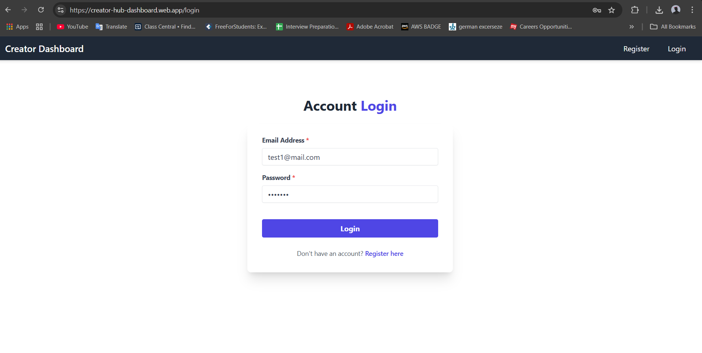
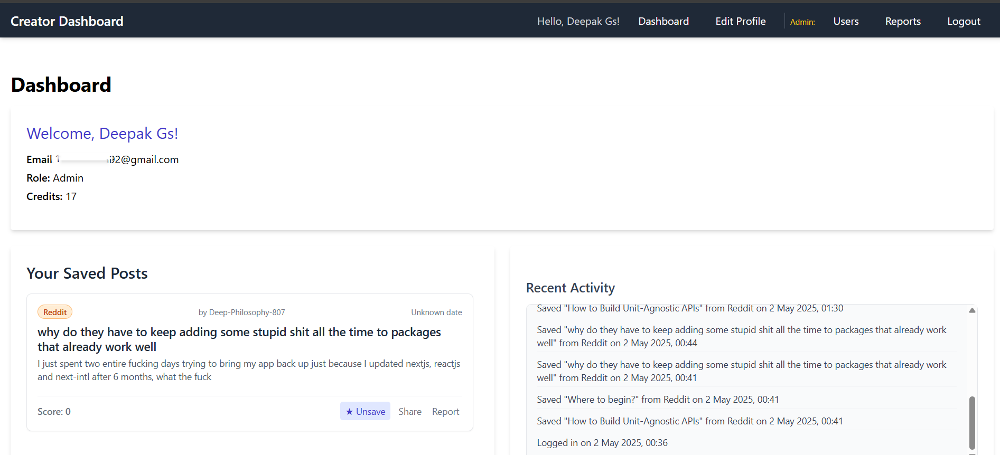
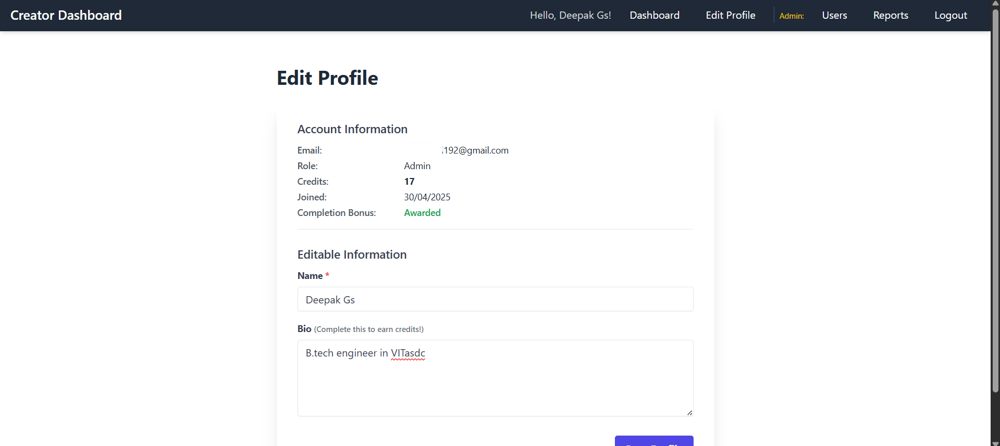
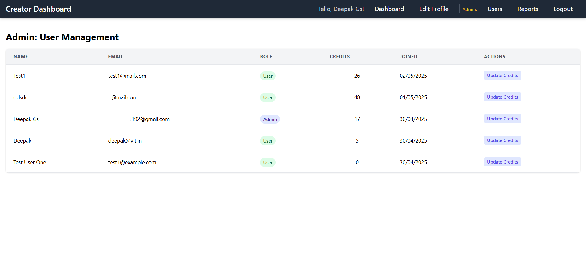
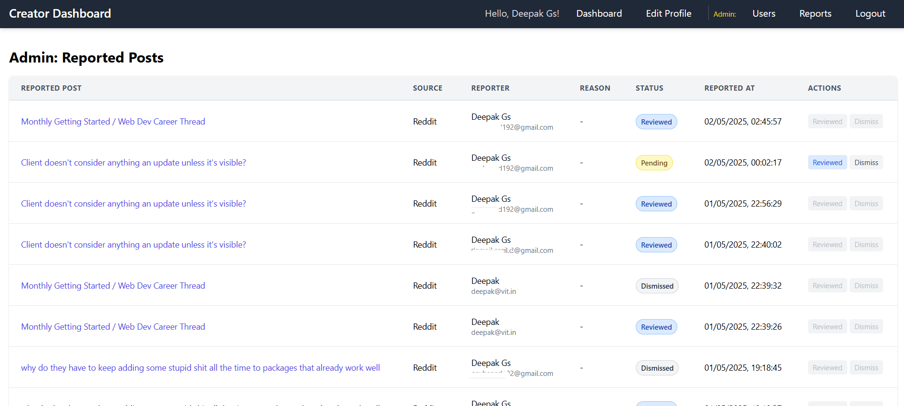

# Creator Dashboard (VertxAI Assignment 1)

## Description

This project is a web application built for the VertxAI MERN Stack Developer Assignment 1. It serves as a dashboard for creators, allowing them to manage their profile, view an aggregated content feed from multiple sources, interact with posts (save, share, report), and earn credit points based on their activity. The application also includes an admin panel for basic user and content management.

## Features Implemented

**User Features:**
* **Authentication:** Secure User Registration and Login using JWT (JSON Web Tokens).
* **Password Security:** Passwords hashed using bcryptjs.
* **Aggregated Feed:** Fetches and displays posts from Reddit (`/r/webdev`) and Twitter/X (requires valid Bearer Token setup).
    * *Note:* Twitter integration requires API v2 keys/tokens and may be subject to rate limiting.
* **Feed Interactions:**
    * Save/Unsave posts to a personalized list.
    * Share post links (copies link to clipboard).
    * Report posts (flags post, awards credits).
* **Dashboard:**
    * Displays logged-in user's information (Name, Email, Role).
    * Displays current Credit Points balance.
    * Displays the user's personalized list of Saved Posts.
    * Displays the main Aggregated Feed.
    * Displays a list of the user's Recent Activity (Login, Save, Report, Profile Updates).
* **Profile Editing:** Users can view and update their Name and Bio.
* **Credit System:**
    * Earn credits (+10) for the first login each day.
    * Earn credits (+25) for completing profile (adding a Bio for the first time).
    * Earn credits (+1) for saving a post (first time only).
    * Earn credits (+2) for reporting a post.

**Admin Features:**
* **Role-Based Access:** Separate 'Admin' role with access to specific panels/actions.
* **Protected Routes:** Admin sections are protected, accessible only by logged-in Admins.
* **User Management:** Admins can view a list of all registered users.
* **Credit Management:** Admins can view and directly update the credit balance for any user.
* **Report Management:** Admins can view a list of all reported posts, including who reported them and when. Admins can update the status of a report (e.g., 'Reviewed', 'Dismissed').

## Tech Stack

* **Frontend:** React.js (Vite), Tailwind CSS, Axios, React Router DOM, React Context API
* **Backend:** Node.js, Express.js, Mongoose
* **Database:** MongoDB Atlas
* **Authentication:** JSON Web Tokens (jsonwebtoken), bcryptjs
* **Deployment (Planned):**
    * Backend: Google Cloud Run (Docker)
    * Frontend: Firebase Hosting (or Google Cloud alternative)

## Screenshots


**Login Page:**


**Dashboard:**


**Edit Profile Page:**


**Admin - User Management:**


**Admin - Reported Posts:**



## Instructions to Run Locally

**Prerequisites:**
* Node.js and npm (or yarn) installed
* Git installed
* MongoDB Atlas account (free tier is sufficient)
* (Optional but Recommended) Twitter Developer Account with API v2 Bearer Token for full feed functionality.

**Steps:**

1.  **Clone the Repository:**
    ```bash
    git clone <your-github-repository-url>
    cd <your-repository-name>
    ```

2.  **Setup Backend:**
    * Navigate to the backend directory: `cd backend`
    * Install dependencies: `npm install`
    * Create a `.env` file in the `backend` directory (`backend/.env`).
    * Add the required environment variables to `.env`:
        ```dotenv
        MONGO_URI=<your_mongodb_atlas_connection_string>
        JWT_SECRET=<your_strong_random_jwt_secret>
        PORT=5000
        TWITTER_BEARER_TOKEN=<your_twitter_api_v2_bearer_token> # Optional, needed for Twitter feed
        ```
        *(Replace placeholders with your actual values. Get MONGO_URI from MongoDB Atlas cluster connection details)*
    * Start the backend server: `node server.js` (or `nodemon server.js` if you have nodemon)
        *The server should start on `http://localhost:5000` (or your specified PORT).*

3.  **Setup Frontend:**
    * Open a **new terminal window**.
    * Navigate to the frontend directory: `cd frontend` (relative to the project root)
    * Install dependencies: `npm install`
    * Create a `.env` file in the `frontend` directory (`frontend/.env`).
    * Add the required environment variable (make sure the URL points to your running backend):
        ```dotenv
        VITE_API=http://localhost:5000/api
        ```
    * Start the frontend development server: `npm run dev`
        *The frontend should start, typically on `http://localhost:5173`.*

4.  **Access Application:** Open `http://localhost:5173` (or the URL provided by Vite) in your web browser.

## Deployment Steps (Planned Outline)

**Backend (Google Cloud Run):**

1.  **Prerequisites:** Google Cloud SDK (`gcloud`) installed and configured, Docker installed, GCP Project with Billing enabled, Artifact Registry API enabled.
2.  **Containerize:** Create a `Dockerfile` and `.dockerignore` in the `backend` directory.
3.  **Build Image:** `docker build -t gcr.io/[PROJECT_ID]/creator-dashboard-backend:v1 .` (replace `[PROJECT_ID]`)
4.  **Push Image:** `docker push gcr.io/[PROJECT_ID]/creator-dashboard-backend:v1` (ensure Docker is authenticated with GCP: `gcloud auth configure-docker`)
5.  **Deploy Service:**
    ```bash
    gcloud run deploy creator-dashboard-backend \
      --image=gcr.io/[PROJECT_ID]/creator-dashboard-backend:v1 \
      --platform=managed \
      --region=YOUR_CHOSEN_REGION \ # e.g., us-central1
      --allow-unauthenticated \
      --port=5000 \ # Or the port your app listens on
      --set-env-vars="PORT=5000,MONGO_URI=YOUR_ATLAS_URI,JWT_SECRET=YOUR_JWT_SECRET,TWITTER_BEARER_TOKEN=YOUR_TWITTER_TOKEN"
      # Consider using Google Secret Manager for sensitive variables instead of --set-env-vars
    ```
6.  **Note Service URL:** Record the URL provided after successful deployment.

**Frontend (Firebase Hosting):**

1.  **Prerequisites:** Firebase account, Firebase project created, `firebase-tools` CLI installed (`npm install -g firebase-tools`).
2.  **Login:** `firebase login`
3.  **Initialize:** Run `firebase init hosting` inside the `frontend` directory.
    * Select your Firebase project.
    * Specify your build output directory (usually `dist` for Vite) as the public directory.
    * Configure as a single-page app (rewrite all URLs to `/index.html`).
4.  **Configure Backend URL:** Create a production environment file (e.g., `.env.production`) in the `frontend` directory or use build-time variables to set `VITE_API` to the deployed **Cloud Run Service URL**.
5.  **Build:** Run `npm run build` inside the `frontend` directory.
6.  **Deploy:** Run `firebase deploy --only hosting`.
7.  **Note Hosting URL:** Record the URL provided after successful deployment.

**Database (MongoDB Atlas):**

1.  Ensure Network Access rules in MongoDB Atlas allow connections from Google Cloud Run (either specific IPs or `0.0.0.0/0` - less secure).

*(Remember to replace placeholders like `<...>` or `YOUR_...` with your actual values)*